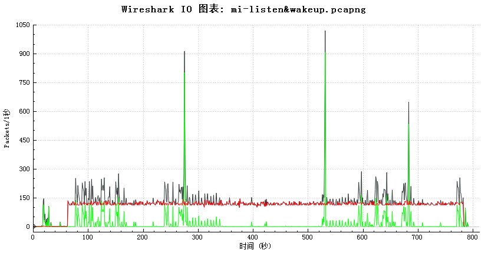

# IoT-Home-Guard

IoT-Home-Guard is a project to help people discover malware in smart home devices.

For users the project can help to detect compromised smart home devices. For security researchers it is also useful in network analysis and malicious hehaviors detection. 

In July 2018 we had completed the first version. We will complete the second version by October 2018 with improvement of user experience and increased number of identifiable devices.

The first generation is a hardware device based on Raspberry Pi with wireless network interface controllers. We will customize new hardware in the second generation. Software part is available in our Github. The system can be set up with software part in laptops after essential environment configuration. 

## Proof of principle

Our approach is based on the detection of malicious network traffic. A device implanted malwares will communicate with remote server, trigger a remote shell or send audios/videos to server.

The chart below shows the network traffic of a device which implanted snooping malwares.  
Red line : traffic between devices and a remote spy server.  
Green line : normal traffic of devices.  
Black line : Sum of TCP traffic.  

## Supported Devices

Device Name | Product Version |
:---------: | :---------:|
Xiaomi MINI smart speaker | LX01 |
Amazon Echo v1 smart speaker | v1 |
Amazon Echo v2 smart speaker | v2 |
Xiaofang ip camera | iSC5 |
Baidu WiFi Translator | TUGE830 |
Xiaomi Mijia driving recorder | ZNHSJ01BY |
Netease Youdao smart translator | GTA07 |

## Modules of IoT-Home-Guard

1. AP module and Data flow catcher: Catch network traffic.
2. Traffic analying engine: Extract characteristics from network traffic and compare them with device fingerprint database.
3. Device fingerprint database: Normal network behaviors of each devices, based on whitelist. Call APIs of 360 threat intelligence database ([https://ti.360.net/](https://ti.360.net/)).
4. Web server: There may be a web server in the second generation. 

## Procedure of IoT-Home-Guard

                                               ___________________       ___________________
                                              |                   |     |                   |
                                              | data_flow_catcher |<----| devices connected |
                                              |___________________|     |___________________|
                                                   ¦
                                                   ¦
     ____________________________              ____↓________________  
    |                            |            |                     |
    | device_fingerprint_databse |<---------> | flow_analyze_engine |
    |____________________________|       ¦    |_____________________|
                                         ¦         ↑
                                         ¦         ¦
     __________________________________  ¦     ____↓_______              _________________
    |                                  | ¦    |            |            |                 |
    | 360 threat intelligence database |<-    | web_server |<-----------| user interfaces |
    |__________________________________|      |____________|            |_________________|

The tool works as an Access Point, connected manually by devices under test, sends network traffic to traffic analyzing engine for characteristic extraction. Traffic analyzing engine compares characteristics with entries in device fingerprint database to recognize device type and suspicious network connection. Device fingerprint database is a collect of normal behaviors of each device based on whitelist. Additionally, characteristics will be searched on threat intelligence database of Qihoo 360 to identify malicious behaviors. A web server is set up as user interfaces.

## Tutorials of IoT-Home-Guard

For a hardware tool, see IoT-Home-Guard/Hardware_tool/README.md  
For a software tool, see IoT-Home-Guard/Software_tool/README.md
