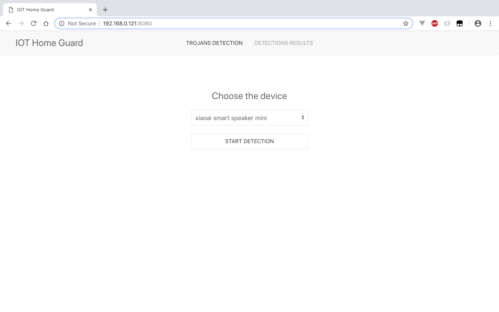
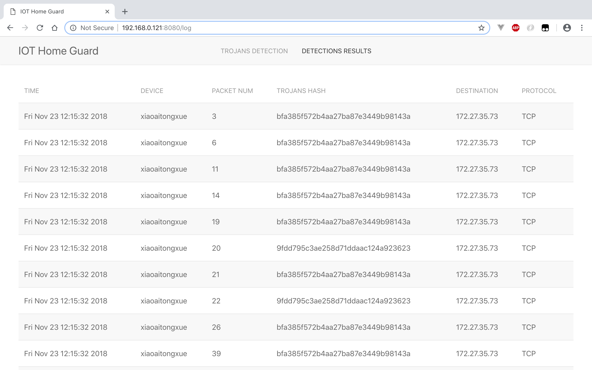

To setup environment, run:

    git clone https://github.com/arthastang/IoT-Home-Guard
    cd IoT-Home-Guard/software_tools/
    python setup.py install

You can use the following command to detect whether the target IoT device is implanted with a Trojan:

    ./IoT-Home-Guard.py

to setup the webserver,run:

    ./homeguard
    
webserver will run on 8080 port.   

Demo:

